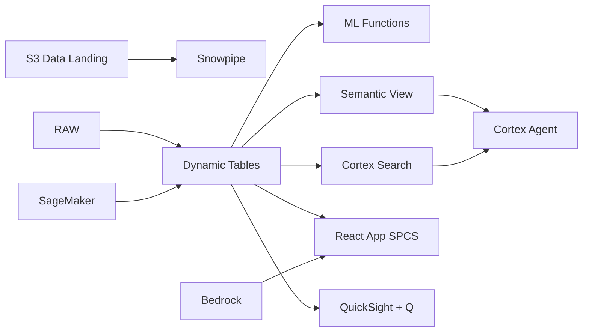

# EUDR Compliance Engine

Automated EU Deforestation Regulation compliance for Indonesia's 51M-tonne CPO industry — geospatial deforestation checks, Dynamic Tables build compliance dossiers, and Cortex AI extracts evidence from satellite imagery metadata.

## Architecture

The EU Deforestation Regulation requires full geolocation traceability for all palm oil entering the EU market. Indonesia — producing 60% of global palm oil — must verify 15,000+ plot polygons against deforestation baselines and generate due diligence statements for every shipment. With Rp 200 trillion in annual EU exports at stake, automated compliance is existential.



## Snowflake Capabilities

| Capability | Implementation |
|-----------|---------------|
| Dynamic Tables | PLOT_DEFORESTATION_CHECK / SHIPMENT_COMPLIANCE_STATUS / DDS_GENERATION_QUEUE / RISK_HEATMAP |
| ML Functions | ML.ANOMALY_DETECTION |
| Cortex AI | COMPLETE, AI_CLASSIFY, SUMMARIZE |
| Cortex Search | 200 documents indexed |
| Cortex Agent | EUDR_COMPLIANCE_AGENT |
| Semantic View | EUDR_COMPLIANCE_ANALYTICS |
| React App (SPCS) | 5 tabs + DemoGuide |


## AWS Services

| Service | Role in Demo |
|---------|-------------|
| Amazon S3 | Store satellite imagery tiles and GeoJSON polygon files |
| AWS Lambda | Trigger geospatial checks on new satellite data arrival |
| Amazon SageMaker | ML model for deforestation classification from satellite features |
| Amazon Location Service | Geospatial polygon operations and map visualization |
| Amazon Bedrock (Claude) | Generate regulatory compliance narratives for due diligence statements |
| Amazon QuickSight + Q | EUDR compliance dashboard with geospatial risk views |


## Personas

| Persona | Role | Key Questions |
|---------|------|---------------|
| **Ir. Hendra Wijaya** | Chief Sustainability Officer | "What percentage of shipments are EUDR-compliant?" "Which supply chains have deforestation risk?" |
| **Dr. Sari Indrawati** | Geospatial Analyst | "Show me plots overlapping with post-2020 deforestation areas." "Which concessions need updated polygon boundaries?" |


## Data

| Table | Rows | Description |
|-------|------|-------------|
| PLOT_POLYGONS | 15,000 | Georeferenced plot boundaries for all supply chain plantations (GeoJSON) |
| DEFORESTATION_BASELINE | 50,000 | Post-2020 forest cover change data from satellite imagery |
| SHIPMENT_DOSSIERS | 20,000 | Per-shipment compliance documentation and geolocation links |
| DUE_DILIGENCE_STATEMENTS | 3,000 | Generated EUDR due diligence statements for EU submission |
| SATELLITE_ALERTS | 100,000 | GLAD/GFW deforestation alert points with confidence scores |
| COMPLIANCE_DOCS | 200 | EUDR regulatory text, guidance documents, and precedent decisions |


## Build Instructions

### Prerequisites
- Snowflake account with ACCOUNTADMIN access
- Cortex AI enabled (ML Functions, Search, Agent)
- Warehouse: EUDR_WH (Medium)
- AWS CLI with access (us-west-2)

### Deployment

```bash
snowsql -f snowflake/00_setup.sql
snowsql -f snowflake/01_marketplace_install.sql
snowsql -f snowflake/02_raw_tables.sql
snowsql -f snowflake/03_staging.sql
snowsql -f snowflake/04_dynamic_tables.sql
snowsql -f snowflake/05_search.sql
snowsql -f snowflake/06_ml_models.sql
snowsql -f snowflake/07_semantic_view.sql
snowsql -f snowflake/08_agent.sql
```

### React App (SPCS)
```bash
cd app && npm ci && npm run build
docker build -t aws-indonesia-palm-oil-eudr-app .
docker push bdiqc8sm-default.registry.snowflakecomputing.com/palm_oil_eudr/app/aws_indonesia_palm_oil_eudr/app:latest
```

### Demo Mode
Open the app URL with `?demo=true` for presenter view.

## Build Modes

### Snowflake Only
Run scripts 00-08 (skip AWS-specific integration). Uses:
- **Snowflake Internal Stage + Iceberg Tables** instead of Amazon S3
- **Snowflake Tasks + Dynamic Tables** instead of AWS Lambda
- **ML.ANOMALY_DETECTION** instead of Amazon SageMaker
- **Snowflake GEOGRAPHY functions** instead of Amazon Location Service
- **Cortex Complete** instead of Amazon Bedrock (Claude)
- **Snowflake Intelligence (Cortex Analyst)** instead of Amazon QuickSight + Q

### Full AWS + Snowflake
Run all scripts including AWS integration. Deploy QuickSight dashboard from `quicksight/`.

## Business Impact

Industry research and Snowflake customer outcomes:
- **Indonesia exported US$28.5B in palm oil products in 2023 — EU is the second-largest destination** — [BPS Indonesia](https://www.bps.go.id/)
- **EUDR enforcement begins Dec 2025 — non-compliant shipments face EU market exclusion** — [European Commission](https://environment.ec.europa.eu/topics/forests/deforestation_en)
- **15,000+ supply chain polygons need geolocation verification for Indonesia's EU palm oil trade** — [Trase](https://www.trase.earth/)
- **Automated compliance reduces due diligence cost by 70% vs manual verification** — [Proforest](https://www.proforest.net/)


## Key Demo Numbers

- **15,000 polygons** plot boundaries verified against deforestation baseline
- **94.2% compliant** active shipments verified EUDR-compliant
- **3,000 DDS** due diligence statements generated
- **100,000 alerts** satellite deforestation alerts processed
- **47 plots** flagged for deforestation overlap
- **Rp 200T+** annual EU export revenue at risk


## License

Apache 2.0 — See [LICENSE](LICENSE) for details.

This is a personal demo project and is not an official Snowflake offering. It comes with no support or warranty.